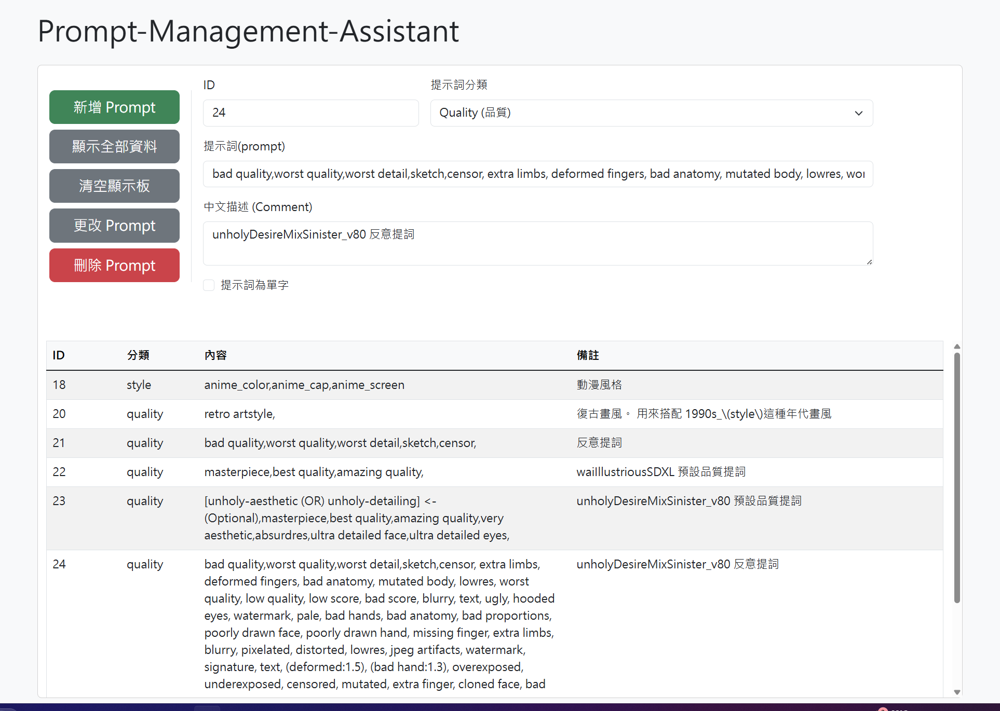

# Prompt Manager

個人用提示詞管理工具，為自己 ComfyUI AI 繪圖工作流使用的小資料庫。

---

## 功能
- 新增 / 查詢 / 刪除提示詞
- 依分類篩選（Quality / Style）
- 標記是否為單字

## Tech Stack
| 類別 | 技術 |
|---|---|
| 後端 | Python、Flask |
| 資料庫 | SQLite |
| 前端 | HTML、Bootstrap、JavaScript |

## TODO
- [ ] update_prompt 路由補完
- [ ] 關鍵字搜尋功能
- [ ] 分類欄動態新增
- [ ] UI 優化
- [ ] 防呆輸入

## 目前進度
最後更新：2026-04-22

已完成：
- [x] Flask 基本架構
- [x] SQLite 串接
- [x] 基本新增 / 查詢 / 刪除 / 更改
- [x] 點擊列表自動帶入欄位

## 目前UI預覽

